# New On the 15 & ドック 一体型 はんだ付け済み品の組み立て方

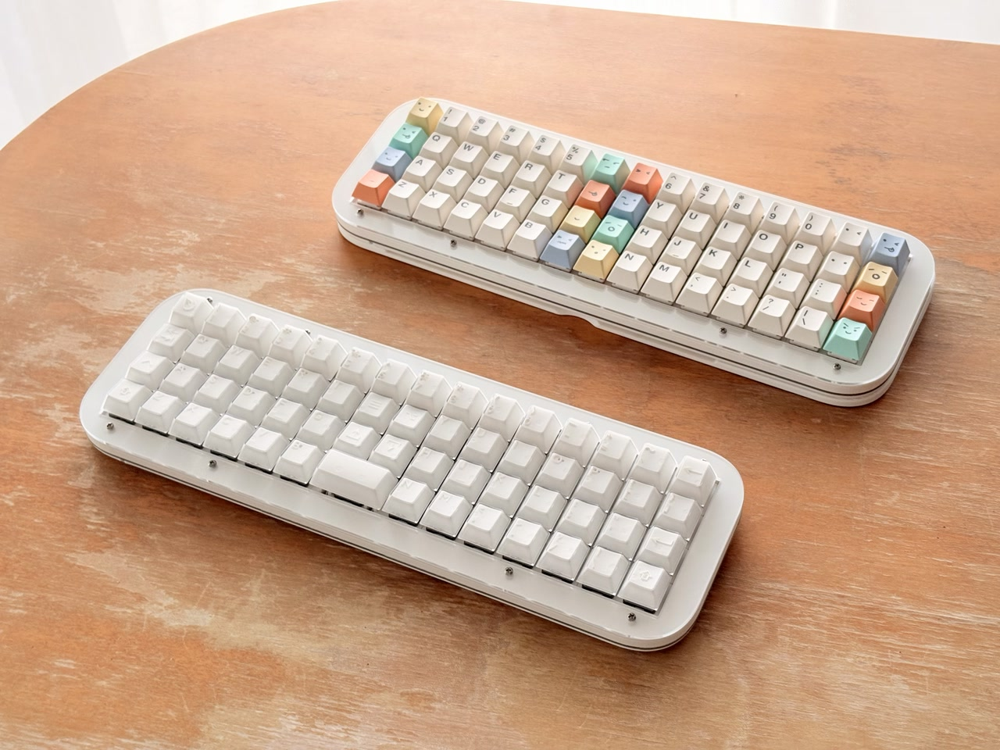

目次
1. [ご購入の前に](#1-ご購入の前に)
2. [内容品](#2-内容品)
3. [組み立て](#3-組み立て)
4. [使い方](#4-使い方)
5. [トラブルシューティング](#5-トラブルシューティング随時更新)
6. [保守品・公開データ](#6-保守品公開データ)

## 1. ご購入の前に

### 1.1 キット以外に必要なもの

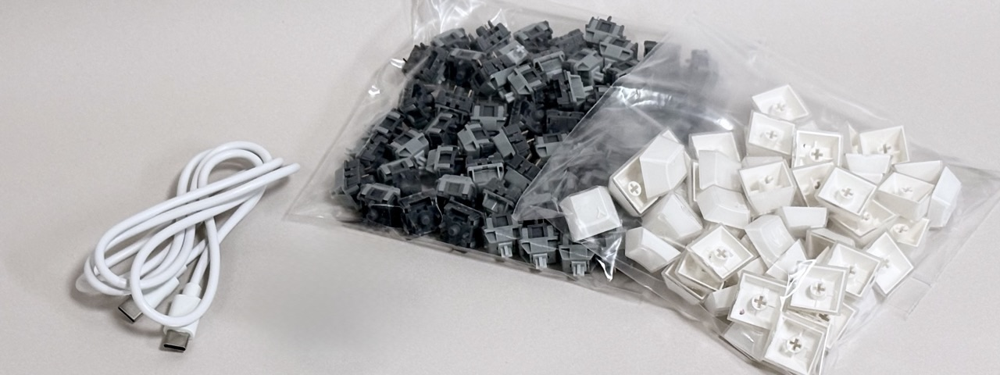

<table>
    <tr>
        <td><a href="https://shop.yushakobo.jp/collections/cherry-mx-clone">Cherry MX互換のキースイッチ</a></td>
        <td>〜60</td>
    </tr>
    <tr>
        <td><a href="https://shop.yushakobo.jp/collections/keycaps">キースイッチに対応したキーキャップ</a></td>
        <td>〜60</td>
    </tr>
    <tr>
        <td><a href="https://amzn.to/3XS9qRu">データ転送に対応したType-C USBケーブル</a></td>
        <td>1</td>
    </tr>
    <tr><td><a href="https://link.amazon/B0gqRyy0B">プラスの精密ドライバー</a></td><td>1</td></tr>
    <tr><td><a href="https://link.amazon/B0dEvnT2f">単4電池</a>（任意）</td><td>2</td></tr>
    <tr>
        <td>Windows / Mac（iPad、Androidでも使用できますが設定にPCが必要です）</td>
        <td>1</td>
    </tr>
</table>

### 1.2 LEDについて

標準ではLEDは搭載されていません。実装をご希望の場合はBOOTHでLEDを追加の商品を同時にご購入ください。

### 1.3 2Uキーについて

画像の場所を横長の2Uキーに変更可能です。
ご希望の場合はBOOTHで2Uキーに変更の商品を同時に購入し、メッセージで場所を指定してください。
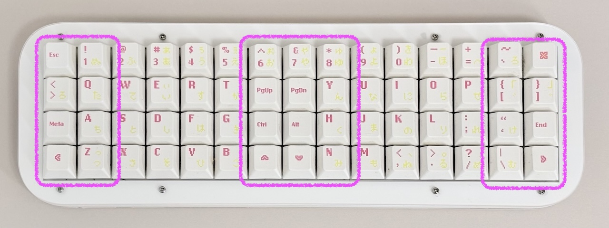
プレートマウントのスタビライザーをご自身でご用意いただける場合は料金を頂戴しませんので事前にご連絡ください。

## 2. 内容品

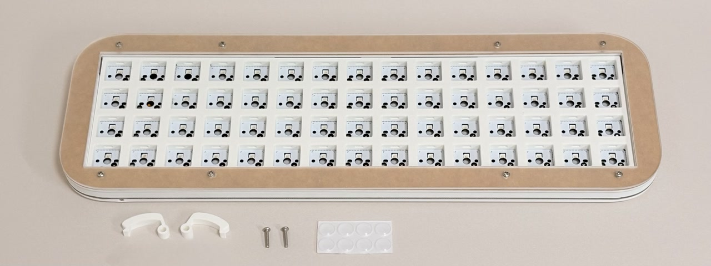

<table>
    <tr><td>本体</td><td>1</td></tr>
    <tr><td>ドック</td><td>1</td></tr>
    <tr><td>LRボタン（大）</td><td>2</td></tr>
    <tr><td>M2x10mmネジ</td><td>2</td></tr>
    <tr><td>ゴム足</td><td>8</td></tr>
</table>

## 3. 組み立て

本体表面からネジを外し、アクリルプレート2枚を取り外します。
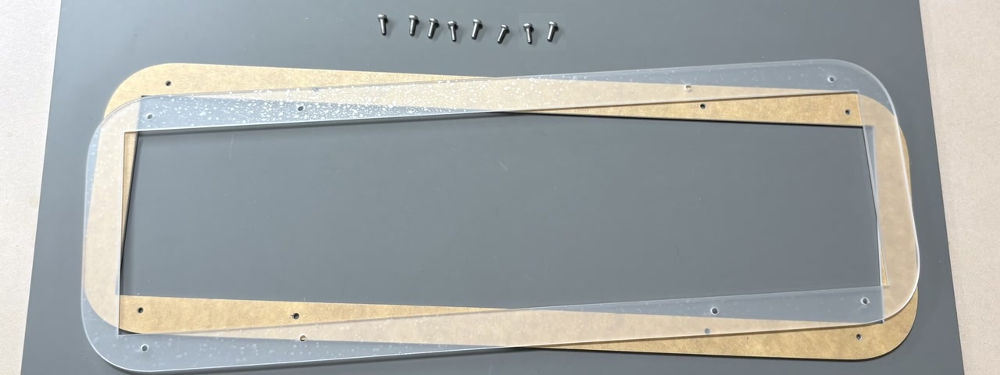

スライドスイッチとLRボタンをなくさないようにします。
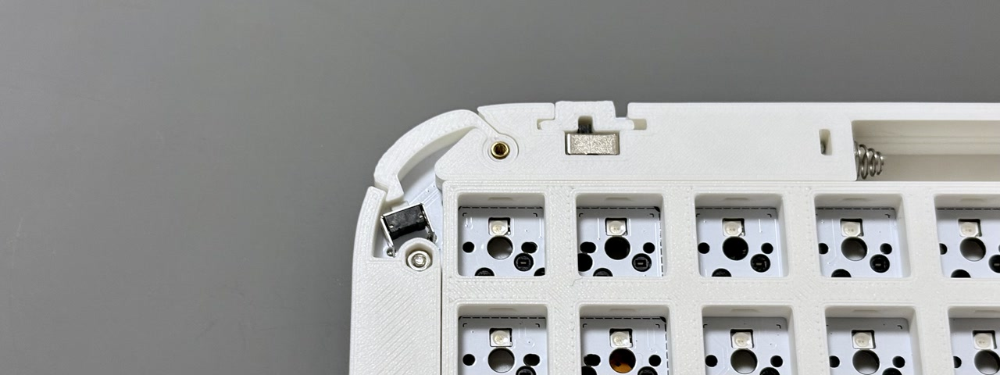

LRボタンは、大きくて押しやすいボタンに変更することが可能です。

スタビライザーを使う場合は、バーを手前側にして設置します。
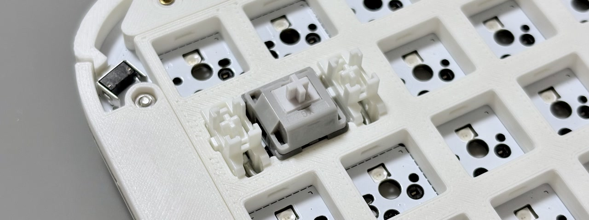

キースイッチを差し込みます。スイッチの端子が曲がらず、ソケットに正しく入っていることを確認してください。
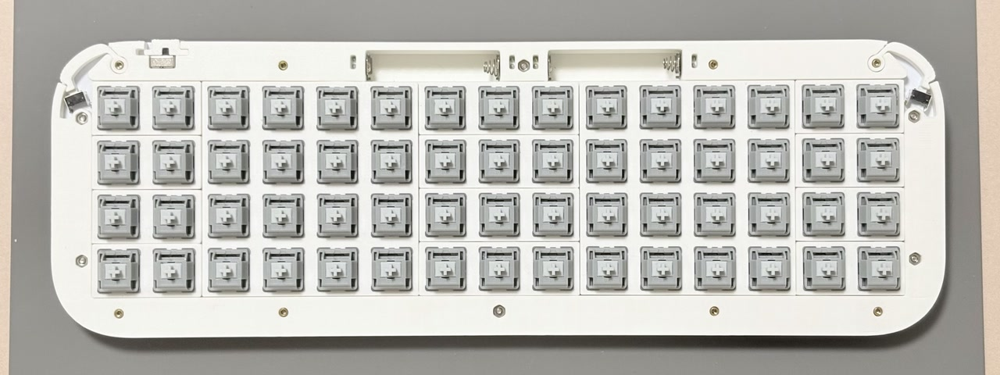

アクリルプレートから保護シールを剥がし、6mmネジで固定します。
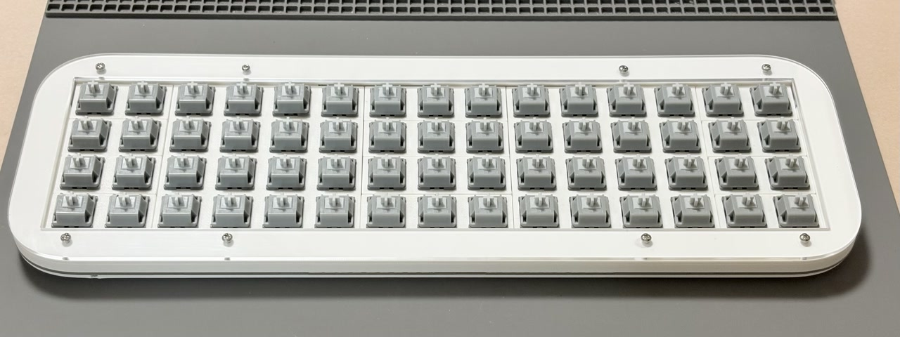

ゴム足を取り付けます。
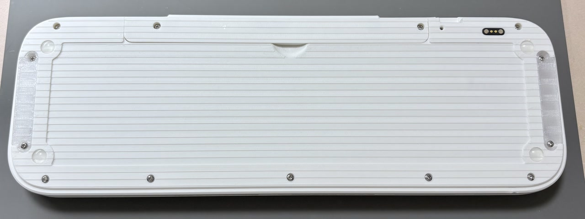

電池の蓋は磁石式になっていますが、ネジで固定する場合は5mmネジを外して10mmネジで固定してください。
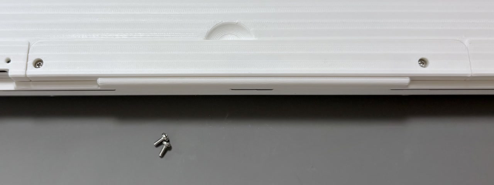

キーキャップを取り付けます。
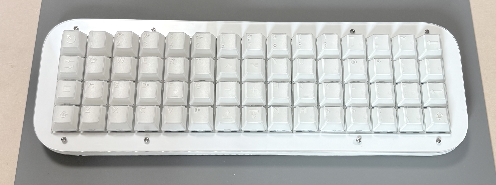

ドックにもゴム足を取り付けたら完成です。
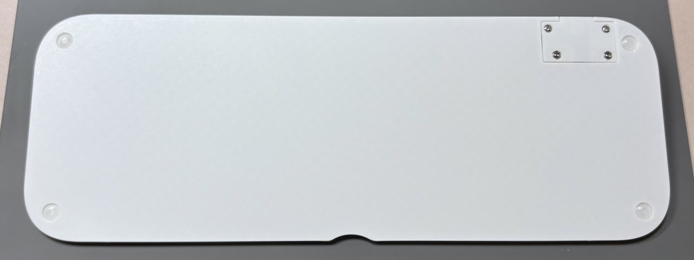

ドックにUSBケーブルを接続し、本体を乗せると電源が供給されることを確認します。
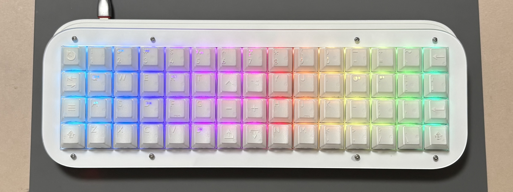
電池で使う場合は単4電池を入れて、スライドスイッチをマークのある側に動かしてください。

## 4. 使い方

### 4.1 ファームウェアのインストール

こちらのuf2ファイルをダウンロードしてください。
- [`onthe15-x15-zmk.uf2`](https://github.com/Taro-Hayashi/New-On-the-15/releases/latest/download/onthe15-x15-zmk.uf2)

USBケーブルでドックではなく本体をPCと接続し、左上のキーを押しながらRボタンを押すと新しいドライブが現れます。対応するuf2ファイルをドラッグ&ドロップします。
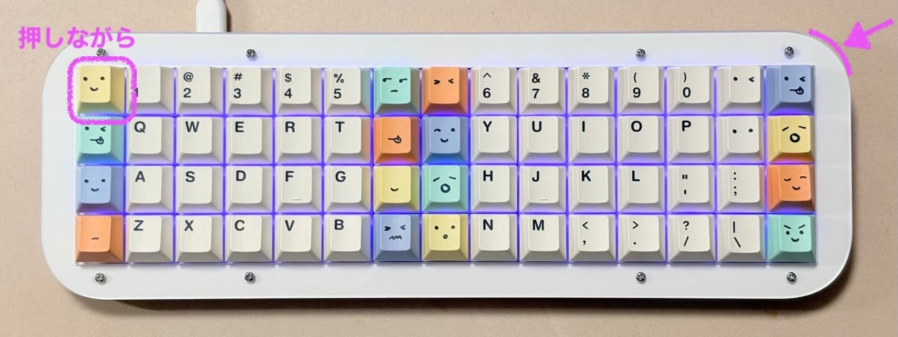
ドライブが出ない場合は裏面の小窓から爪楊枝などでリセットボタンを2回押してください。
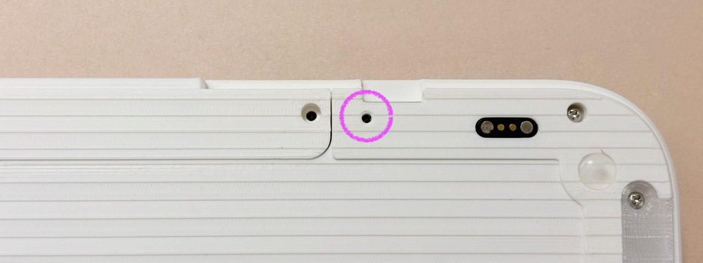

USBケーブルを接続している場合はそのまま有線接続で使用可能です。無線で接続する場合は電池を入れてスライドスイッチをオンにし、ペアリングしてください。

>[!NOTE]
>無線で接続できない場合、接続機器との間にあるUSB 3.0機器や他の無線機器が干渉していたり、大きなものが電波の通り道を邪魔していることがあります。配置を変えてみてください。

### 4.2 DYA Studioに接続する

Google ChromeでDYA Studioにアクセスします。

- https://studio.dya.cormoran.works/

DYA Studioで設定を変更するには、アンロックという操作が必要です。
左上のキーを押しながら右下のキーを押すとアンロックできます。アンロックするとインジケーターが点滅します。
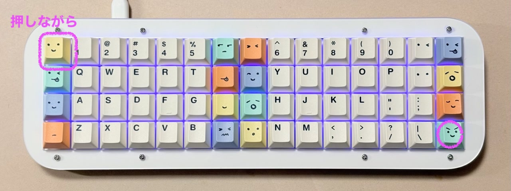

有線か無線かを選んでアクセスして、キーマップタブに移動するとキーの入れ替えができます。
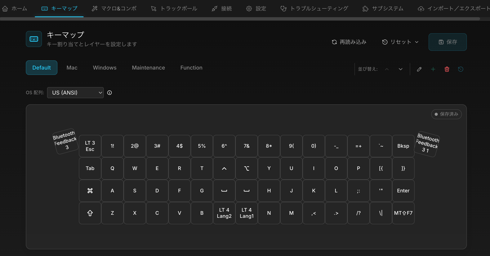

Mod-Tapは長押しでShiftなどの修飾キー、短押しで通常のキーを入力できます。

Layer-Tapは長押しでレイヤーの切り替え、短押しで通常のキーを入力できます。

他にマクロ・コンボ、接続先プロファイルの管理、スリープに入るまでの時間を設定することが可能です。

### 4.3 固有機能の設定

LEDの光り方や電池の種類を別のWebサイトから設定可能です。

DYA Studioのサブシステムからアクセスするか、直接アクセスして接続します。こちらでの変更にもアンロックの操作が要求されます。
- https://studio.tarohayashi.com/

電池は種類によって消費のされ方が違います。デフォルトでは電圧の変化が小さいエネループ等のNiMH充電池が設定されています。
アルカリ乾電池への変更と、残量が少なくなってきた時のインジケーターでの警告をオンオフ可能です。

インジケーターのオンオフを切り替えることができます。

>[!NOTE]
>消費電力が大きいため、電池で動作させる場合は常時点灯はオフを推奨します。

LEDの発光を調節することができます。

エフェクトは数パターンあるのでお好みに合わせてご利用ください。

これらの設定はDYA Studioからキーに割り当てることも可能です。

## 5. トラブルシューティング（随時更新）

### 5.1 何か調子が悪い

settings-reset-zmk.uf2を書き込むことでXIAOをリセット可能です。
ファームウェア更新の要領で書き込んで待つと再びドライブが出てくるので、再度使用するファームウェアをインストールしてください。

### 5.2 キーが反応しない

スイッチを取り外し、端子が曲がっていないか確認してください。曲がっていた場合はラジオペンチなどで伸ばし、取り付けた際に両方の端子が基板のソケットに差し込まれた状態にしてください。
端子が曲がっていない場合は、そのスイッチを基板の別のソケットに差し込んで反応があるか確認してください。反応がない場合はスイッチを交換してください。
スイッチに問題がなく反応がない場合はBOOTHのメッセージでご連絡ください。

## 6. 保守品・公開データ

### 6.1 公開データ

- [回路図](../sch/SCH.md)
- プリント品（準備中）
- [基板外形、アクリルプレート](../plate/PLATE.md)
- [ガーバー（USB基板、フレキシブル基板）](../gerber/GERBER.md)
- ソースコード
	- ZMKファームウェア
		- 使用モジュール
			- zmk-matrix-lighting（準備中）
			- zmk-host-rgb-sync（準備中）
			- [zmk-module-ble-management](https://github.com/cormoran/zmk-module-ble-management)
			- [zmk-feature-default-layer](https://github.com/cormoran/zmk-feature-default-layer)
			- [zmk-feature-custom-settings](https://github.com/cormoran/zmk-feature-custom-settings)
			- [zmk-feature-os-detection](https://github.com/cormoran/zmk-feature-os-detection)
			- [zmk-feature-device-info](https://github.com/cormoran/zmk-feature-device-info)
			- [zmk-feature-runtime-combo](https://github.com/cormoran/zmk-feature-runtime-combo)
			- [zmk-feature-runtime-macro](https://github.com/cormoran/zmk-feature-runtime-macro)
			- [zmk-feature-kscan-diagnostics](https://github.com/cormoran/zmk-feature-kscan-diagnostics)
	- RMKファームウェア

### 6.2 保守品の入手先

- [M2ネジ](https://www.monotaro.com/g/00010425/)（見た目が違うことがあります）
	- 5mm
	- 6mm
	- 8mm
	- 10mm
- [M2ナット](https://www.monotaro.com/g/06150312/)
- 電池端子
	- [プラス（IT-4SP）](https://www.monotaro.com/p/8835/2512/)
	- [マイナス（IT-4SM）](https://www.monotaro.com/p/8835/2521/)
- [スライドスイッチ](https://akizukidenshi.com/catalog/g/g115703/)
- [サイドスイッチ](https://akizukidenshi.com/catalog/g/g114890/)
- [ゴム足 8×2mm](https://link.amazon/B0epStW7h)
- [磁石 6×2mm](https://link.amazon/B0a5OvMwi)
- [ピンヘッダー 2.54mm × 40ピン](https://akizukidenshi.com/catalog/g/g100167/)
- [MXスイッチソケット](https://shop.yushakobo.jp/products/a01ps)

### 6.3 ライセンス

| 対象 | ライセンス | 詳細 |
| --- | --- | --- |
| 回路図 | MIT | [sch/LICENSE](../sch/LICENSE) |
| USB基板ガーバー | CC0 1.0 | [gerber/LICENSE](../gerber/LICENSE) |
| フレキシブル基板ガーバー | CC0 1.0 | [gerber/LICENSE](../gerber/LICENSE) |
| 基板外形、アクリルプレートデータ | CC BY 4.0 | [plate/LICENSE](../plate/LICENSE) |
| 本体プリント品データ | CC BY 4.0 | 準備中 |
| 治具プリント品データ | CC0 1.0 | 準備中 |
| ZMKファームウェア | MIT | [zmk_firmware/LICENSE](../zmk_firmware/LICENSE) |
| RMKファームウェア | MIT | [rmk_firmware/LICENSE](../rmk_firmware/LICENSE) |

2Uスタビライザーはkoktohさんのフットプリントを使用しました。
https://github.com/koktoh/BrownSugar_KBD_KiCad_Library

電池の回路はcormoranさんのdya-dashの回路図を参照しました。
https://github.com/cormoran/dya-dash-keyboard/

### 6.4 販売サイト

- [BOOTH](https://tarohayashi.booth.pm/items/8798135)
